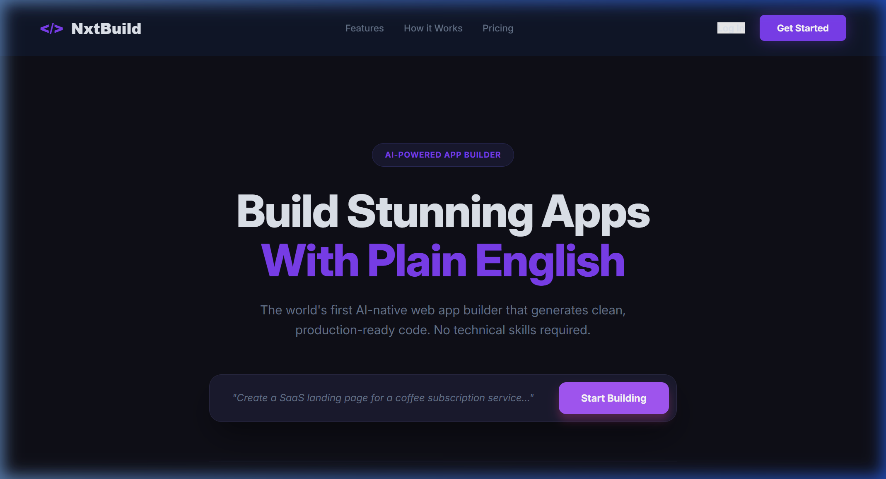
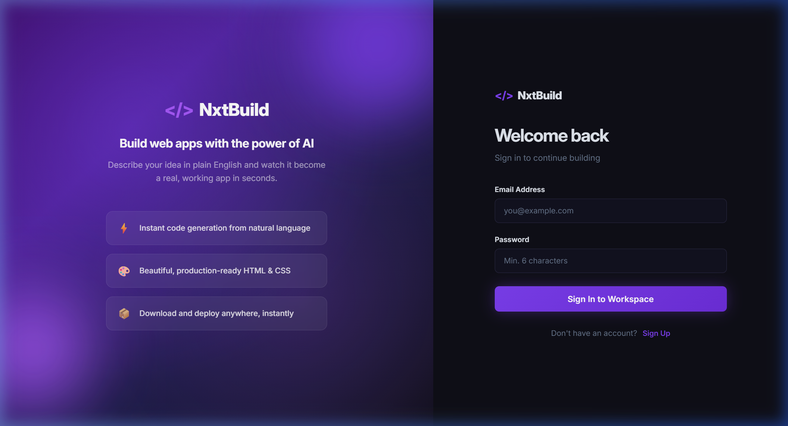

# 🚀 NxtBuild - AI-Powered Web App Builder

NxtBuild is a cutting-edge, AI-powered web app generator. It allows users to instantly build dynamic, production-ready web applications simply by describing them in natural language. Powered by **Google's Gemini 2.5 Flash AI**, a robust Express backend, and a brilliant React Vite frontend matching industry-level premium dark IDE aesthetics.

---

## 📸 Screenshots

### 🏠 Landing Page


### 🔐 Login Page


### 📁 Dashboard


### ⚡ Builder — Live Preview


### 💻 Builder — Code View


### 🕐 Version History Panel


### 🔗 Share Feature


### ✨ Prompt Templates


---

## ✨ Core Features

- **Prompt-to-App:** Formulate an idea in plain English and let NxtBuild handle the entire HTML + CSS + JS scaffold instantly.
- **Dual-Pane IDE Layout:** A specialized fluid workspace featuring a responsive chat sidebar and a sprawling live-rendering workspace.
- **Live Sandbox Preview:** See code executing flawlessly inside a safe `srcDoc` iframe alongside a dedicated Code viewer tab.
- **Instant Export:** Download your generated source code straight from the Dashboard or Builder with a single click.
- **Popout Preview:** Open your generated app in a new browser tab for full-screen viewing.
- **Secure Authentication:** Mongoose + JWT flow supporting seamless user saving and auto-token interception.
- **Project Management:** Create, rename, and delete multiple projects — all saved to MongoDB.
- **Chat History:** Full conversational context so AI remembers your previous messages and refines your app iteratively.
- **🕐 Version History:** View and restore any previous version of your generated code from a slide-in history panel.
- **🔗 Public Share URL:** Generate a public link so anyone can view your generated app without logging in.
- **✨ Prompt Templates:** Pick from pre-built templates on the dashboard to instantly start building common app types.

---

## 🛠️ Tech Stack

| Layer | Technology |
|-------|------------|
| Frontend | React 19, Vite 6, React Router DOM 7 |
| Backend | Node.js, Express 5 |
| Database | MongoDB Atlas, Mongoose 9 |
| Auth | JSON Web Tokens, bcryptjs |
| AI Engine | Google Gemini 2.5 Flash (`@google/genai`) |
| HTTP Client | Axios |
| Cookie Management | js-cookie |
| ID Generation | nanoid |

---

## 🚀 Getting Started

### 1. Prerequisites

- **Node.js** v18 or higher
- A **[Google AI Studio API Key](https://aistudio.google.com/app/apikey)**
- A **MongoDB Atlas** connection string (free tier works)

---

### 2. Clone the Repository

```bash
git clone https://github.com/Bhanuprakash2580/ai-web-app-builder.git
cd ai-web-app-builder
```

---

### 3. Install Dependencies

**Backend:**
```bash
cd server
npm install
```

**Frontend:**
```bash
cd ../client
npm install
```

---

### 4. Configure Environment Variables

Inside the `server` directory, create your `.env` file:

```bash
cd server
cp .env.example .env
```

Then open `server/.env` and fill in your values:

```env
PORT=5000
MONGODB_URI=mongodb+srv://<user>:<password>@cluster.mongodb.net/nxtbuild
JWT_SECRET=supersecret123
GEMINI_API_KEY=AIzaSy...
CLIENT_URL=http://localhost:5173
```

| Variable | Where to Get It |
|----------|----------------|
| `MONGODB_URI` | [MongoDB Atlas](https://cloud.mongodb.com) → Connect → Drivers |
| `JWT_SECRET` | Any random string |
| `GEMINI_API_KEY` | [Google AI Studio](https://aistudio.google.com/app/apikey) |

---

### 5. Run the App

**Option A — Run both together from root folder:**

```bash
npm run dev
```

**Option B — Run separately:**

```bash
# Terminal 1 — Backend
cd server
npm run dev

# Terminal 2 — Frontend
cd client
npm run dev
```

Navigate to **http://localhost:5173** and start building! 🎉

---

## 🔌 API Endpoints

### Auth Routes
| Method | Endpoint | Auth | Description |
|--------|----------|------|-------------|
| POST | `/api/auth/register` | No | Create new account |
| POST | `/api/auth/login` | No | Login and get JWT token |
| GET | `/api/auth/me` | Yes | Get current user profile |
| POST | `/api/auth/logout` | Yes | Logout user |

### Project Routes
| Method | Endpoint | Auth | Description |
|--------|----------|------|-------------|
| GET | `/api/projects` | Yes | Get all user projects |
| POST | `/api/projects` | Yes | Create new project |
| GET | `/api/projects/:id` | Yes | Get single project |
| PUT | `/api/projects/:id` | Yes | Update project title |
| DELETE | `/api/projects/:id` | Yes | Delete project |
| GET | `/api/projects/:id/versions` | Yes | Get version history |
| POST | `/api/projects/:id/versions/restore` | Yes | Restore a version |
| POST | `/api/projects/:id/share` | Yes | Generate public share URL |
| DELETE | `/api/projects/:id/share` | Yes | Disable share link |

### Generation Routes
| Method | Endpoint | Auth | Description |
|--------|----------|------|-------------|
| POST | `/api/generate/:projectId` | Yes | Generate code with Gemini AI |

### Public Routes
| Method | Endpoint | Auth | Description |
|--------|----------|------|-------------|
| GET | `/api/share/:shareId` | No | View shared app (public) |

---

## 📁 Project Structure

```
ai-web-app-builder/
├── client/                        # React Frontend (Vite)
│   └── src/
│       ├── components/
│       │   ├── Navbar.jsx
│       │   ├── ProtectedRoute.jsx
│       │   ├── ProjectCard.jsx
│       │   ├── TemplateCard.jsx        # Prompt templates
│       │   ├── VersionPanel.jsx        # Version history
│       │   ├── ShareModal.jsx          # Share feature
│       │   ├── ChatMessage.jsx
│       │   ├── ChatInput.jsx
│       │   ├── CodeEditor.jsx
│       │   ├── LivePreview.jsx
│       │   └── FeatureCard.jsx
│       ├── context/
│       │   ├── AuthContext.jsx
│       │   └── ToastContext.jsx
│       ├── pages/
│       │   ├── LandingPage.jsx
│       │   ├── LoginPage.jsx
│       │   ├── DashboardPage.jsx
│       │   ├── BuilderPage.jsx
│       │   └── SharedPage.jsx          # Public share view
│       ├── services/
│       │   ├── api.js
│       │   ├── authService.js
│       │   ├── projectService.js
│       │   └── generationService.js
│       └── styles/
│           ├── landing.css
│           ├── login.css
│           ├── dashboard.css
│           ├── builder.css
│           └── navbar.css
│
└── server/                        # Express Backend
    └── src/
        ├── config/
        │   ├── db.config.js
        │   └── gemini.config.js
        ├── constants/
        │   └── prompts.js
        ├── controllers/
        │   ├── auth.controller.js
        │   ├── project.controller.js
        │   └── generation.controller.js
        ├── middleware/
        │   ├── auth.middleware.js
        │   └── error.middleware.js
        ├── models/
        │   ├── User.model.js
        │   └── Project.model.js
        ├── routes/
        │   ├── index.js
        │   ├── auth.routes.js
        │   ├── project.routes.js
        │   └── generation.routes.js
        ├── services/
        │   ├── auth.service.js
        │   ├── project.service.js
        │   ├── generation.service.js
        │   └── gemini.service.js
        └── utils/
            ├── jwt.utils.js
            └── code.utils.js
```

---

## 💡 Prompt Templates Available

| Template | Description |
|----------|-------------|
| 🏪 Landing Page | Business landing page with hero, features, and CTA |
| 👤 Portfolio Site | Personal portfolio with projects and skills |
| ✅ To-Do App | Task manager with add, complete, and delete |
| 🧮 Calculator | Functional calculator with dark theme |
| 🌦 Weather Dashboard | Weather UI with cards and forecast |
| 📊 Admin Dashboard | Analytics dashboard with stats and data table |

---

## 🔒 Security

- Passwords hashed with **bcrypt** (10 salt rounds)
- JWT tokens stored in **secure cookies** with 7-day expiry
- All project routes protected by **authentication middleware**
- Users can only access **their own projects**
- Generated apps run inside **sandboxed iframes**
- Share links can be **enabled or disabled** anytime by the owner

---

## 🌐 Inspired By

| Platform | URL |
|----------|-----|
| Bolt.new | https://bolt.new |
| Lovable.dev | https://lovable.dev |
| v0.dev | https://v0.dev |
| Replit Agent | https://replit.com |

---

## 👨‍💻 Author

**Bhanu Prakash Suram**

[](https://github.com/Bhanuprakash2580)

---

## 📄 License

This project is licensed under the **MIT License**.

---

> ⭐ Star this repo if you found it helpful!